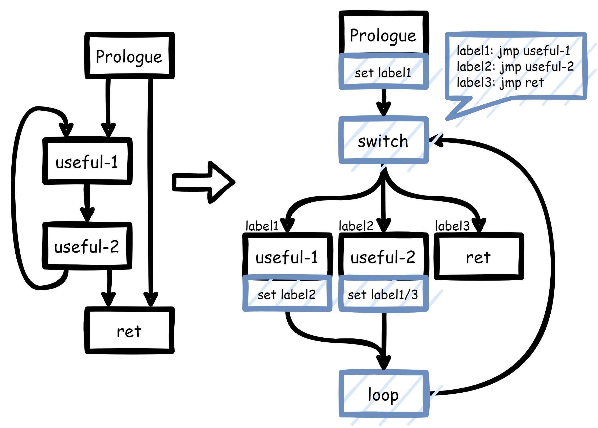
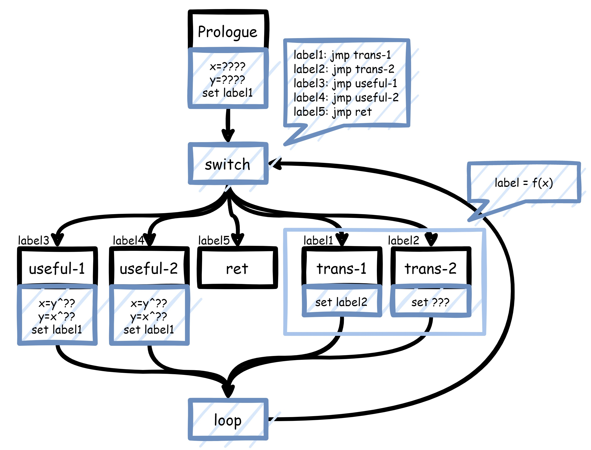

# ToyObfuscator

Some simple obfuscator ;) (base on llvm-10)

## Compile

### Build out-tree pass

```bash
git clone https://github.com/veritas501/ToyObfuscator.git
cd ToyObfuscator
mkdir build && cd build
cmake .. -DLLVM_DIR=/usr/lib/llvm-10/lib/cmake/llvm/
make -j`nproc`
```

Compiled pass at "ToyObfuscator/build/src/libLLVMToyObfuscator.so"

### Build in-tree pass

```bash
# clone llvm-10.0.1
git clone https://github.com/llvm/llvm-project.git --depth 1 -b llvmorg-10.0.1
# apply custom patch
./build_clang.sh <DIR_TO_llvm-project>
# build clang and llvm as normal
cd <DIR_TO_llvm-project>
mkdir build && cd build
cmake -DLLVM_ENABLE_PROJECTS=clang -DCMAKE_BUILD_TYPE=Release -G "Unix Makefiles" ../llvm
make -j`nproc` # or 'make clang -j`nproc`' for just compile clang
```

## Pass flags

- `-fla_plus`: control flow graph flatten plus version
    - `-dont_fla_invoke`: used with `-fla_plus`, flattening each function except which contains InvokeInst
    - `-fla_cnt=X`: used with `-fla_plus`, do flatten X times

## Quickstart

- demo.c

```c
#include <stdint.h>
#include <stdio.h>
#include <stdlib.h>

void foo1() {
    puts("argc == 1");
}

void foo2(int argc) {
    for (int i = 0; i < argc; i++) {
        puts("argc != 1");
    }
}

int main(int argc, char **argv) {
    if (argc == 1) {
        foo1();
    } else {
        foo2(argc);
    }
    return argc;
}
```

Use out-tree pass to do obfuscation.

```bash
clang -emit-llvm -c demo.c -o demo.bc
opt -load ./libLLVMToyObfuscator.so -fla_plus demo.bc -o demo_obf.bc
clang demo_obf.bc -o demo_obf
```

- demo_obf.ll

```bash
llvm-dis demo_obf.bc
```

function `foo2`:

```llvm
; Function Attrs: noinline nounwind optnone uwtable
define dso_local void @foo2(i32 %0) #0 {
  %2 = alloca i32, align 4
  %3 = alloca i32, align 4
  store i32 %0, i32* %2, align 4
  %label = alloca i32
  %x = alloca i32
  %y = alloca i32
  %4 = alloca i32
  %5 = alloca i32
  store i32 298058585, i32* %label
  store i32 -803332310, i32* %x
  store i32 -1204918219, i32* %y
  br label %Dispatcher

Trans_0:                                          ; preds = %Dispatcher
  %6 = load i32, i32* %x
  store i32 %6, i32* %4
  %7 = load i32, i32* %y
  store i32 %7, i32* %5
  %8 = load i32, i32* %x
  store i32 %8, i32* %y
  store i32 460730405, i32* %x
  %9 = load i32, i32* %x
  %10 = load i32, i32* %y
  %11 = add i32 %10, %9
  %12 = shl i32 %10, 8
  %13 = lshr i32 %10, 24
  %14 = or i32 %13, %12
  %15 = xor i32 %14, %11
  store i32 %11, i32* %x
  store i32 %15, i32* %y
  store i32 1815737693, i32* %label
  br label %Dispatcher

Trans_3:                                          ; preds = %Dispatcher
  %16 = load i32, i32* %x
  %17 = load i32, i32* %y
  %18 = add i32 %17, %16
  %19 = shl i32 %17, 22
  %20 = lshr i32 %17, 10
  %21 = or i32 %20, %19
  %22 = xor i32 %21, %18
  store i32 %18, i32* %x
  store i32 %22, i32* %y
  %23 = load i32, i32* %4
  store i32 %23, i32* %x
  %24 = load i32, i32* %5
  store i32 %24, i32* %y
  store i32 %22, i32* %label
  br label %Dispatcher

Trans_1:                                          ; preds = %Dispatcher
  %25 = load i32, i32* %x
  %26 = load i32, i32* %y
  %27 = add i32 %26, %25
  %28 = shl i32 %26, 28
  %29 = lshr i32 %26, 4
  %30 = or i32 %29, %28
  %31 = xor i32 %30, %27
  store i32 %27, i32* %x
  store i32 %31, i32* %y
  store i32 1197840973, i32* %label
  br label %Dispatcher

32:                                               ; preds = %Dispatcher
  %33 = call i32 @puts(i8* getelementptr inbounds ([10 x i8], [10 x i8]* @.str.1, i64 0, i64 0))
  %34 = load i32, i32* %y
  %35 = xor i32 %34, -824075049
  store i32 %35, i32* %x
  %36 = load i32, i32* %x
  %37 = xor i32 %36, 198614652
  store i32 %37, i32* %y
  store i32 298058585, i32* %label
  br label %Dispatcher

38:                                               ; preds = %Dispatcher
  %39 = load i32, i32* %3, align 4
  %40 = load i32, i32* %2, align 4
  %41 = icmp slt i32 %39, %40
  %42 = load i32, i32* %y
  %43 = xor i32 %42, -799371851
  %44 = xor i32 %42, -1637481724
  %45 = select i1 %41, i32 %43, i32 %44
  store i32 %45, i32* %x
  %46 = load i32, i32* %x
  %47 = xor i32 %46, 1651061640
  %48 = xor i32 %46, 1262310110
  %49 = select i1 %41, i32 %47, i32 %48
  store i32 %49, i32* %y
  store i32 298058585, i32* %label
  br label %Dispatcher

50:                                               ; preds = %Dispatcher
  %51 = load i32, i32* %3, align 4
  %52 = add nsw i32 %51, 1
  store i32 %52, i32* %3, align 4
  %53 = load i32, i32* %y
  %54 = xor i32 %53, -203712883
  store i32 %54, i32* %x
  %55 = load i32, i32* %x
  %56 = xor i32 %55, -2065749477
  store i32 %56, i32* %y
  store i32 298058585, i32* %label
  br label %Dispatcher

57:                                               ; preds = %Dispatcher
  ret void

Dispatcher:                                       ; preds = %Trans_3, %Trans_2, %Trans_1, %Trans_0, %50, %32, %38, %59, %DefaultBranch, %1
  %58 = load i32, i32* %label
  switch i32 %58, label %DefaultBranch [
    i32 -1925297453, label %59
    i32 2014756364, label %38
    i32 947951719, label %32
    i32 830688616, label %50
    i32 -1172152496, label %57
    i32 298058585, label %Trans_0
    i32 1815737693, label %Trans_1
    i32 1197840973, label %Trans_2
    i32 773620844, label %Trans_3
  ]

DefaultBranch:                                    ; preds = %Dispatcher
  br label %Dispatcher

59:                                               ; preds = %Dispatcher
  store i32 0, i32* %3, align 4
  %60 = load i32, i32* %y
  %61 = xor i32 %60, 1175808718
  store i32 %61, i32* %x
  %62 = load i32, i32* %x
  %63 = xor i32 %62, -2065749477
  store i32 %63, i32* %y
  store i32 298058585, i32* %label
  br label %Dispatcher

Trans_2:                                          ; preds = %Dispatcher
  %64 = load i32, i32* %x
  %65 = load i32, i32* %y
  %66 = add i32 %65, %64
  %67 = shl i32 %65, 19
  %68 = lshr i32 %65, 13
  %69 = or i32 %68, %67
  %70 = xor i32 %69, %66
  store i32 %66, i32* %x
  store i32 %70, i32* %y
  store i32 773620844, i32* %label
  br label %Dispatcher
}
```

## Pass design

### fla_plus

先来说说传统ollvm中的flat吧。



在这种flat思路中，switch块中用来判断jump地址的信息为label，而每个块其实都对应一个label，而这个label值在其块结束时被设置。
因此恢复者可以先通过switch块收集label和basic block间的对应关系，之后在每个basic block的结尾获取这个block设置的新label从而推出下一个block是谁（如果是条件跳转就获取后两个block以及对应的条件）。
或者说，恢复者可以先通过特征找到所有的useful block，然后借助angr等符号执行工具，找到他的下一个或下两个block。
换言之，在这种思路中，假设A->B，那么已知A，通过switch信息以及A末尾的label便可求出后继B。

为了对抗这种恢复思路，我打算在A->B的过程中引入状态变量。即A跳转到B依赖于进入A的状态。



这里我引入了x, y, label三个变量（目前设计为三个`uint32_t`）。粗略一看可以发现，所有的useful block后面设置的label都为label1，而label1指向trans-1。在switch中不仅存在useful block，还存在translate block。translate block的作用是进行一个f的运算，因为label和x存在如下关系：`label=f(x)`。所以，在我的这个方案中，A->B并不是依靠写在block后面的label值，而是x值。那有人就要问了，那我拿到A中的x，不就能计算出对应的label，得到A->B的关系了吗？并没这么容易。我们发现，x的获取并不是简单的赋值，而是使用的xor，`x=y^imm32_const1; y=x^imm32_const2`。因此，想要得到A执行完x的值，还必须知道进入A时的y值，而y值并不存在于label的计算也不存在于switch的分发中。因此，想要知道A的后继，必须知道进入A时的y值，而这个y值单纯将A抽出来分析是无法得到的，因为它和程序的运行态相关，得到的方法只有将这个flat函数完整从prologue开始模拟到A块的开头，正如程序正常执行时那样。因此，这个方法也不是万能的，依然有破解的方法，只是不能像之前那样将一个个block拉出来逐个击破。
