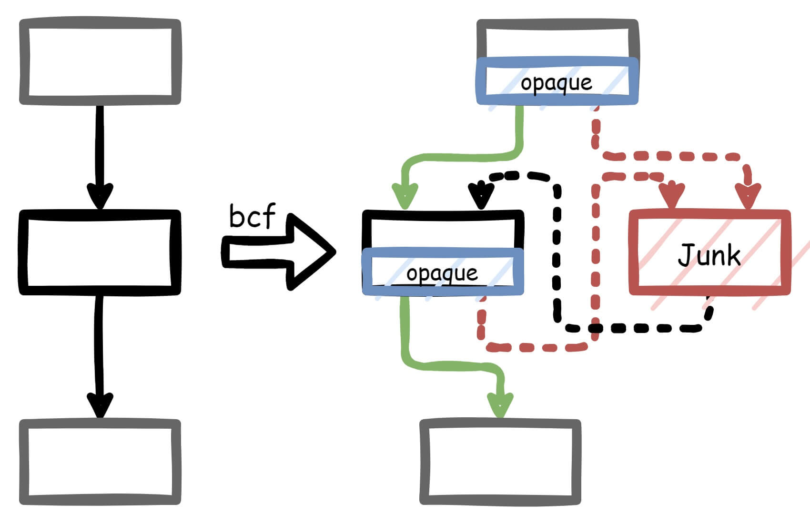
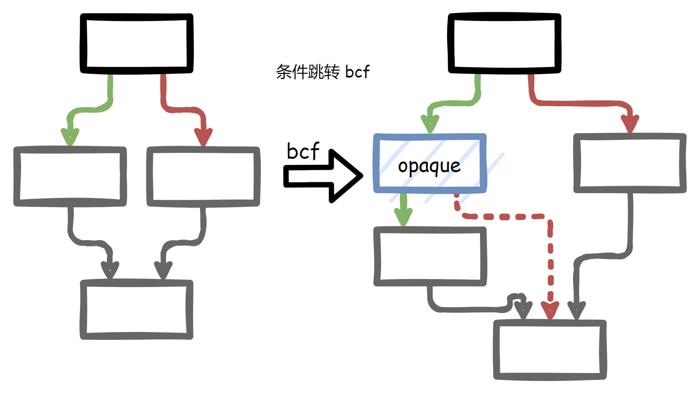

# ToyObfuscator

Some simple obfuscator ;) (base on llvm-10)

## Compile

### Build out-tree pass

```bash
git clone https://github.com/veritas501/ToyObfuscator.git
cd ToyObfuscator
mkdir build && cd build
cmake .. -DLLVM_DIR=/usr/lib/llvm-10/lib/cmake/llvm/
make -j`nproc`
```

Compiled pass at "ToyObfuscator/build/src/libLLVMToyObfuscator.so"

### Build in-tree pass

```bash
# clone llvm-10.0.1
git clone https://github.com/llvm/llvm-project.git --depth 1 -b llvmorg-10.0.1
# apply custom patch
./build_clang.sh <DIR_TO_llvm-project>
# build clang and llvm as normal
cd <DIR_TO_llvm-project>
mkdir build && cd build
cmake -DLLVM_ENABLE_PROJECTS=clang -DCMAKE_BUILD_TYPE=Release -G "Unix Makefiles" ../llvm
make -j`nproc` # or 'make clang -j`nproc`' for just compile clang
```

## Pass flags

- `-fla_plus`: control flow graph flatten plus version
    - `-dont_fla_invoke`: used with `-fla_plus`, flattening each function except which contains InvokeInst (default=false)
    - `-fla_cnt=X`: used with `-fla_plus`, do flatten X times (default=1, max=3)
- `-bcf`: bogus control flow
    - `-bcf_rate`: the probability that each basic block will be obfuscated. (default=30, max=100)

## Quickstart

- demo.c

```c
#include <stdint.h>
#include <stdio.h>
#include <stdlib.h>

void foo1() {
    puts("argc == 1");
}

void foo2(int argc) {
    for (int i = 0; i < argc; i++) {
        puts("argc != 1");
    }
}

int main(int argc, char **argv) {
    if (argc == 1) {
        foo1();
    } else {
        foo2(argc);
    }
    return argc;
}
```

Use out-tree pass to do obfuscation.

```bash
clang -emit-llvm -c demo.c -o demo.bc
opt -load ./libLLVMToyObfuscator.so -fla_plus demo.bc -o demo_obf.bc
clang demo_obf.bc -o demo_obf
```

## Pass design

### fla_plus

先来说说传统ollvm中的flat吧。


在这种flat思路中，switch块中用来判断jump地址的信息为label，而每个块其实都对应一个label，而这个label值在其块结束时被设置。
因此恢复者可以先通过switch块收集label和basic block间的对应关系，之后在每个basic block的结尾获取这个block设置的新label从而推出下一个block是谁（如果是条件跳转就获取后两个block以及对应的条件）。
或者说，恢复者可以先通过特征找到所有的useful block，然后借助angr等符号执行工具，找到他的下一个或下两个block。
换言之，在这种思路中，假设A->B，那么已知A，通过switch信息以及A末尾的label便可求出后继B。

为了对抗这种恢复思路，我打算在A->B的过程中引入状态变量。即A跳转到B依赖于进入A的状态。


这里我引入了x, y, label三个变量（目前设计为三个`uint32_t`）。粗略一看可以发现，所有的useful block后面设置的label都为label1，而label1指向trans-1。在switch中不仅存在useful block，还存在translate block。translate block的作用是进行一个f的运算，因为label和x存在如下关系：`label=f(x)`。所以，在我的这个方案中，A->B并不是依靠写在block后面的label值，而是x值。那有人就要问了，那我拿到A中的x，不就能计算出对应的label，得到A->B的关系了吗？并没这么容易。我们发现，x的获取并不是简单的赋值，而是使用的xor，`x=y^imm32_const1; y=x^imm32_const2`。因此，想要得到A执行完x的值，还必须知道进入A时的y值，而y值并不存在于label的计算也不存在于switch的分发中。因此，想要知道A的后继，必须知道进入A时的y值，而这个y值单纯将A抽出来分析是无法得到的，因为它和程序的运行态相关，得到的方法只有将这个flat函数完整从prologue开始模拟到A块的开头，正如程序正常执行时那样。因此，这个方法也不是万能的，依然有破解的方法，只是不能像之前那样将一个个block拉出来逐个击破。

此外flat_plus还支持了`InvokeInst`，在使用try...catch的c++函数中出现（貌似还有其他情况也会使用InvokeInst），ollvm是直接将invoke屏蔽了，只要这个函数中存在就不对这个函数做flat。

思路如下。invoke的unwind分支的开头为`LandingPadInst`，我们找到所有包含landingpad的block以及这些block的后继，将其在后续flat过程中排除，其余的block继续做flatten。其中，invoke类似branch，作为terminator，其后面不能再添加指令，因此只能修改默认的跳转分支并创建trampoline，将flat的逻辑写在trampoline中。此外，fixStack的逻辑需要一些改动，这里不再赘述。


### bcf

虚假控制流一般就是通过不透明谓词（opaque predicates）来实现。

例如ollvm中所用的是`(y < 10 || x * (x + 1) % 2 == 0)`，其中x, y是全局变量且初值为0，因此这个等式恒成立。
由于从binary角度分析，x, y被分配在`.bss`上，IDA并不会将其视为常量0，故不会对这个等式进行化简。

其实关于不透明谓词我们明显有更好的对象，例如构造满足条件的`sqrt(b^2-4ac)`让其恒小于0，这种式子IDA还没有能力分析出结果。

或者如我借鉴的[这篇文章](https://blog.quarkslab.com/turning-regular-code-into-atrocities-with-llvm.html)所述，
构造两个不同的素数p1, p2，再取两个不同的正整数常数a1, a2，再从程序中随机挑选两个int类型的变量v1, v2，则下述不等式恒成立：
`p1*((v1|a1)^2) != p2*((v2|a2)^2)`。

此外，我对ollvm中的虚假控制流的做了一些调整。
传统的ollvm中的bcf pattern如下：



分析这种bcf有几种方案：
1. 由于x, y为全局变量很容易识别，只要在IDA中通过修改段属性为ro即可让IDA自动分析这个不透明谓词。例如[这篇文章](https://zhuanlan.zhihu.com/p/151853593)。
2. 此外我们也可以注意到，这个方案中Junk块在运行过程中永远不会被执行到，因此还有一种思路就是将永远不被执行到的块去除。例如[这篇文章](https://bbs.pediy.com/thread-266005.htm)。
3. 通过查找这种固定的pattern来直接去除不透明谓词。例如[这篇文章](https://www.52pojie.cn/thread-995577-1-1.html)。

可能还有其他思路，这里不再列举。

为了对抗思路1，我没有引入全局变量，我使用的不透明谓词中只使用了常量和程序中正常使用的变量。

为了对抗思路2，我在不透明谓词中引入的虚假跳转分支都为函数中本就真实存在的block，这样，虽然不透明谓词中的虚假跳转不会发生，但目标块是在程序运行中是被真实执行过的。




至于思路3暂时还没有做对抗，毕竟目前的不透明谓词也只有一种，只要识别到了特征都很方便去除。